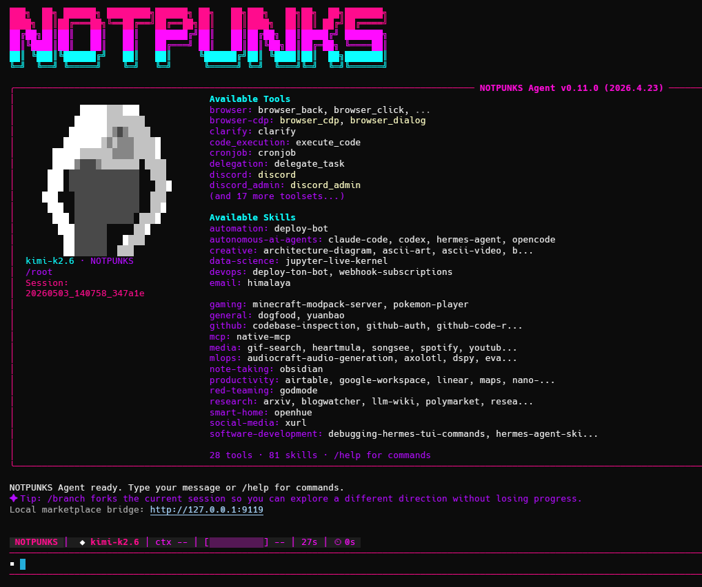

<p align="center">
  
</p>

<h1 align="center">NOTPUNKS Agent</h1>

<p align="center">
  Local-first AI agent for terminal work, messaging, wallet-gated skills, and private sNFT skill cartridges.
</p>

<p align="center">
  <a href="https://agent.notpunks.com/"><strong>Website</strong></a>
  &nbsp;&nbsp;|&nbsp;&nbsp;
  <a href="https://agent.notpunks.com/docs"><strong>Docs</strong></a>
  &nbsp;&nbsp;|&nbsp;&nbsp;
  <a href="https://skilzzz.com/"><strong>Skill Marketplace</strong></a>
  &nbsp;&nbsp;|&nbsp;&nbsp;
  <a href="https://github.com/notpunksdev/NOTPUNKS-Agent/releases/tag/v2026.5.12.2"><strong>Latest Release</strong></a>
</p>

<p align="center">
  
  
  
  
  
</p>

<p align="center">
  <a href="#install"></a>
  <a href="https://agent.notpunks.com/docs"></a>
  <a href="https://skilzzz.com/"></a>
</p>

<table>
  <tr>
    <td width="33%">
      <strong>Agent Runtime</strong><br>
      Terminal, files, browser, memory, cron, messaging, MCP, and local tool execution.
    </td>
    <td width="33%">
      <strong>Skill Marketplace</strong><br>
      Create, publish, buy, install, license-check, and update agent skills through Skilzzz.
    </td>
    <td width="33%">
      <strong>sNFT Cartridges</strong><br>
      Package reusable agent workflows as verifiable private Skill NFT cartridges.
    </td>
  </tr>
</table>

NOTPUNKS Agent is an open-source AI operator that runs on your own machine, VPS, or cloud environment. It can work in the terminal, edit files, run tools, use browser/search, remember project context, operate through messaging platforms, and install wallet-gated skills from the NOTPUNKS marketplace.

The project extends the agent model with **sNFT Protocol**, a Skill NFT format for packaging reusable agent workflows as verifiable, portable, private skill cartridges.

## Install

One command:

```bash
curl -fsSL https://agent.notpunks.com/install | bash
```

Windows users should run the WSL installer from PowerShell:

```powershell
irm https://agent.notpunks.com/install.ps1 | iex
```

Prefer fixed release archives instead of a remote installer:

```text
Linux x64:    https://github.com/notpunksdev/NOTPUNKS-Agent/releases/download/v2026.5.12.2/NOTPUNKS-Agent-2026.5.12.2-linux-x64.tar.gz
macOS ARM64:  https://github.com/notpunksdev/NOTPUNKS-Agent/releases/download/v2026.5.12.2/NOTPUNKS-Agent-2026.5.12.2-macos-arm64.tar.gz
Windows WSL:  https://github.com/notpunksdev/NOTPUNKS-Agent/releases/download/v2026.5.12.2/NOTPUNKS-Agent-2026.5.12.2-windows-wsl.zip
Checksums:    https://github.com/notpunksdev/NOTPUNKS-Agent/releases/download/v2026.5.12.2/checksums.txt
Build hashes: https://github.com/notpunksdev/NOTPUNKS-Agent/releases/download/v2026.5.12.2/build-hashes.txt
```

Start the agent:

```bash
notpunks
```

Check the installation:

```bash
notpunks doctor
```

Supported environments: Linux, macOS, WSL2, and Android through Termux. Native Windows is not a target runtime; use WSL2.

## Why NOTPUNKS Agent

| Layer | What it does |
| --- | --- |
| Local-first runtime | Runs from your terminal with local config, local skills, local sessions, and local logs. |
| Agentic tooling | Terminal, file editing, browser, web search, code execution, memory, cron, delegation, MCP, vision, image generation, and more. |
| Model choice | OpenRouter, OpenAI/Codex-compatible providers, Anthropic, Gemini, Bedrock, Hugging Face, NVIDIA NIM, Kimi/Moonshot, Ollama/vLLM/LM Studio-style local endpoints, and custom providers. |
| Messaging gateway | Telegram, Discord, Slack, WhatsApp, Signal, Matrix, Mattermost, Email, SMS, Home Assistant, webhooks, and HTTP/API gateway mode. |
| Wallet access | TON Connect wallet flow for NFT access, creator gates, Skill NFT licenses, and marketplace permissions. |
| Protected sNFT runtime | Secret encrypted Skill NFT cartridges install without public plaintext source and execute through the agent runtime after ownership unlock. |
| Skills | Create, install, inspect, audit, publish, unpublish, buy, license-check, and install marketplace skills. |
| sNFT Protocol | Package skills as verifiable private cartridges with metadata, bundle hash, access policy, license data, and portable install fields. |
| Open source | MIT-licensed codebase you can inspect, fork, self-host, extend, and integrate. |

## Quick Start

Run setup:

```bash
notpunks setup
```

Choose a model/provider:

```bash
notpunks model
```

Open the agent:

```bash
notpunks
```

Useful first slash commands:

```text
/help
/model
/effort low
/language ru
/wallet connect
/skills marketplace
/skills create deploy-bot
/skills publish deploy-bot --price 1
/skills buy deploy-bot
/skills install-marketplace deploy-bot
```

## Skills And sNFT

A skill is a reusable `SKILL.md` package that teaches the agent a workflow: deploy a project, manage a repository, audit contracts, operate a data pipeline, configure infrastructure, write docs, or follow a domain-specific procedure.

NOTPUNKS adds a marketplace and ownership layer:

```text
create skill
  -> scan bundle
  -> publish listing
  -> generate sNFT metadata
  -> wallet purchase/license
  -> local install through agent bridge
```

An sNFT cartridge can include:

- skill name, version, description, category, and creator;
- bundle hash for integrity verification;
- access policy and license tier;
- marketplace and metadata URLs;
- security scan verdict and findings;
- install data for compatible agents;
- encrypted private payload reference for protected paid cartridges.

The NFT is not just an image. It becomes a portable license and distribution primitive for executable agent knowledge. For protected paid skills, the marketplace can expose public metadata and hashes while the full skill source stays inside a secret encrypted cartridge unlocked only through wallet ownership and a compatible runtime.

## Access Model

| Action | Access |
| --- | --- |
| Install the agent | Anyone |
| Run the closed beta agent | Wallet with at least one NOT Punks NFT |
| Create local skills | NOT Punks beta holder |
| Publish marketplace skills | Matching NOT Punks + NOT Punks Girls pair with the same number |
| Use marketplace skills | NOT Punks holder, Skill Pass holder, or matching Skill NFT license |
| Buy a paid skill | Connected TON wallet and successful purchase/license flow |
| Elemental Kids benefit | 1 Elemental Kid = 1 paid skill indulgence slot |
| Earn from skills | Creator of the published marketplace listing |

The agent exposes these as tiers: `beta`, `creator`, `skill_pass`, and `licensed_skills`.
During beta, NOT Punks holder access is still required before the agent runs.

## Core Commands

Shell commands:

| Command | Purpose |
| --- | --- |
| `notpunks` | Start the terminal agent |
| `notpunks setup` | Run the setup wizard |
| `notpunks model` | Configure provider and model |
| `notpunks config` | View or edit configuration |
| `notpunks doctor` | Diagnose installation, config, tools, and providers |
| `notpunks gateway setup` | Configure messaging platforms |
| `notpunks gateway` | Start the messaging gateway |
| `notpunks skills` | Manage local, official, marketplace, and sNFT skills |
| `notpunks update` | Pull the latest code and reinstall dependencies |
| `notpunks uninstall` | Remove the agent, optionally keeping user data |

In-agent slash commands:

| Slash command | Purpose |
| --- | --- |
| `/help` | Show available commands |
| `/new` or `/reset` | Start a fresh session |
| `/model` | Switch configured model |
| `/effort` or `/reasoning` | Inspect or change reasoning effort |
| `/wallet connect` | Connect TON wallet |
| `/wallet status` | Check wallet state |
| `/wallet access` | Show NFT/access roles |
| `/skills create <name>` | Create a local skill |
| `/skills publish <skill>` | Publish a skill listing |
| `/skills unpublish <skill>` | Remove a marketplace listing |
| `/skills buy <skill>` | Buy or mint a Skill NFT license |
| `/skills licenses` | Show detected Skill NFT licenses |
| `/skills earnings` | Show creator earnings records |
| `/skills install-marketplace <skill>` | Install a marketplace skill locally |

## Local Files

User state lives under the NOTPUNKS home directory:

```text
~/.notpunks/
  config.yaml      non-secret settings
  .env             API keys, tokens, wallet/marketplace secrets
  skills/          local, created, installed, marketplace, and sNFT skills
  sessions/        saved conversation transcripts
  logs/            agent.log, errors.log, gateway.log
  cron/            scheduled jobs
```

The agent also supports isolated profiles for separate configs, credentials, skills, sessions, gateways, and memory.

## Marketplace Bridge

When the local agent is running, it starts a local marketplace bridge:

```text
Local marketplace bridge: http://127.0.0.1:9119
```

The website can use this bridge to inspect local skill status and install owned marketplace skills into the user's local agent. The bridge is local to the user's machine; it is not a remote hosted agent.

## Messaging Gateway

Set up messaging:

```bash
notpunks gateway setup
notpunks gateway
```

The gateway lets the same agent answer messages, transcribe voice notes, use tools, run scheduled jobs, and deliver results back to the platform where the request started.

Supported adapters include Telegram, Discord, Slack, WhatsApp, Signal, Matrix, Mattermost, Email, SMS, Home Assistant, DingTalk, WeCom, Weixin, Feishu, QQ Bot, BlueBubbles, webhooks, and HTTP/API gateway mode.

The documented public HTTP surface is the gateway/dashboard/bridge API. A hosted OpenAI-compatible `/v1/chat/completions` compatibility layer is not part of this release unless explicitly enabled by downstream deployment code.

## Development

Clone:

```bash
git clone git@github.com:notpunksdev/NOTPUNKS-Agent.git
cd NOTPUNKS-Agent
```

Install editable:

```bash
python3 -m venv .venv
source .venv/bin/activate
pip install -e .
```

Run:

```bash
notpunks
```

Run tests through the project wrapper:

```bash
scripts/run_tests.sh
scripts/run_tests.sh tests/hermes_cli/test_config.py
```

TUI development:

```bash
cd ui-tui
npm install
npm run type-check
npm run build
```

## Repository Map

```text
run_agent.py          core AIAgent conversation loop
cli.py                classic terminal CLI
ui-tui/               Ink terminal UI
tui_gateway/          Python JSON-RPC backend for TUI
hermes_cli/           setup, config, update, skins, commands, dashboard
gateway/              messaging gateway and platform adapters
tools/                tool implementations
skills/               built-in skills
optional-skills/      optional skill packs
agent/wallet/         TON wallet and NFT access flow
website/              documentation site
tests/                test suite
```

## Troubleshooting

If `notpunks` is not found after install, open a new shell and check:

```bash
command -v notpunks
```

If install fails because a proxy is forced:

```bash
unset http_proxy https_proxy HTTP_PROXY HTTPS_PROXY ALL_PROXY all_proxy
```

If the agent starts but tools fail:

```bash
notpunks doctor
```

If marketplace install is blocked by security scan, inspect the finding first. Community skills with a caution verdict require an explicit `--force`; dangerous skills should not be installed.

## Links

- Agent site: https://agent.notpunks.com/
- Deploy guide: https://agent.notpunks.com/deploy
- Docs: https://agent.notpunks.com/docs
- Marketplace: https://skilzzz.com/
- sNFT Protocol: https://snft.notpunks.com/
- Latest release: https://github.com/notpunksdev/NOTPUNKS-Agent/releases/tag/v2026.5.12.2
- Ecosystem site: https://notpunks.com/

## License

MIT. See [LICENSE](./LICENSE).

NOTPUNKS Agent is built on the open-source Hermes Agent project by [Nous Research](https://nousresearch.com), released under the MIT License, Copyright (c) 2025 Nous Research. The upstream license is preserved in `LICENSE`.

This distribution is an independent rebrand and extension. It is not endorsed by Nous Research.
